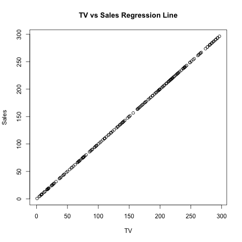

##Abstract
This homework is to reproduce the analysis from Section 3.1 of Ch 3 Linear Regression from the book "An Introduction to Statistical Learning" (by James et al). The homework will analyze the advertising dataset with linear regression and summary statistics.

##Introduction
From the dataset advertising, I can reproduce the simple linear regression with TV and sales. The simple linear regression can predict a quantitative response Y based on predictor variable X. With the modeling, we can tell if there is a relationship exists between TV advertising and Sales. If there exists a positive relationship, the marketing team can decide to increase Tv advertising budget to promote their sales. 

##Data 
The dataset **Advertising.csv** comes from *"http://www-bcf.usc.edu/~gareth/ISL/Advertising.csv* It consists for TV, Radio, Newspaper and Sales columns. The structure of the columns are stored in numeric vectors. 

##Methodology
By using the simple linear regression, we can predict the future sales based on the amount of TV advertising.  
The simple linear regression equation is the following: 

```
Y = A + Bx + e
```

- Y = Sales
- A = Intercept
- Bx = TV advertising 
- e = error 

In R command, we can fit a linear regression model by using the **lm()** command. 
The **null hypothesis** is there does not exist a relationship between TV ad and sales. The alternative hypothesis is that there exists a relationship between TV ad and sales. 

##Results

#### Regression Table

Parameter | Values
----------|----------
Coeff. Estimate | 0.047537
Std. Error | 0.002691
t value | 17.67
p-value | <2e-16
Residual Squared Error | 3.259 on 198 degrees of fd
Adjusted R-Squared | 0.6099
F-statistics | 312.1 on 1 and 198 DF

From the Regression table above, the coefficient estimate on TV is 0.047537. It indicates that every $1 they spend on TV advertising, they will sell 0.047537 unit of product. Based on the large t-value and small p-value, we can reject the null hypothesis. Thus, there exists a relationship between TV ad and sales. The adjusted R-squared show how close the data are to the fitted regression line. It is about 60% accurate to the actual regression line. 

This scatter plot shows that there is a positive correlation exists between TV ad and sales. There is not any outliers in the group. The sales increase as the TV ads amount increase. Thus, we can reject our null hypothesis.

##Conclusions
This homework shows the relationship between TV advertising and sales. There exists a positive correlation between the TV advertising and sales. If the marketing team spend more money on TV advertising, they will generate more sales. Based on the table, we can apply the same linear regression model to radio and newspaper. 